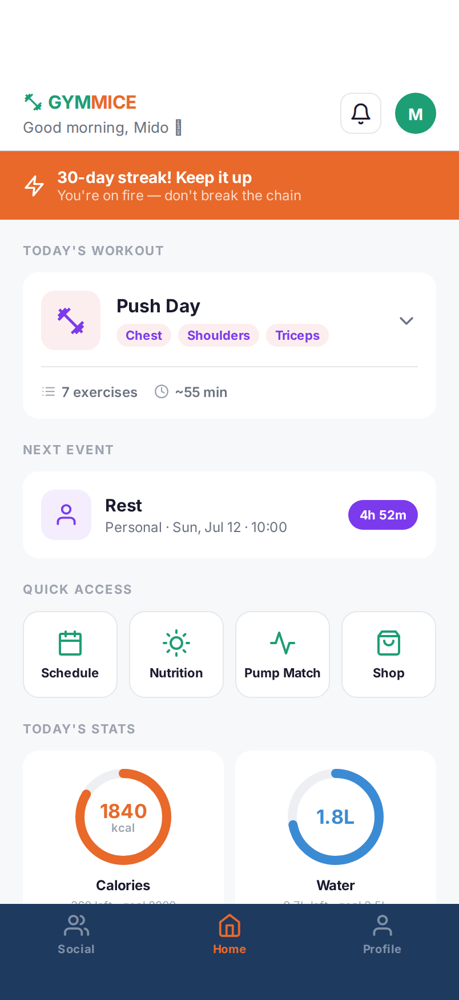
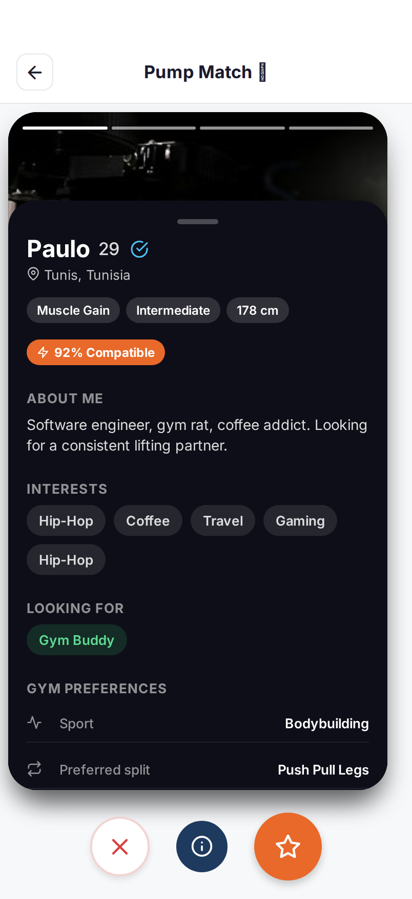

# GymMice

**Train. Eat. Connect.**

GymMice is a mobile fitness app prototype that brings workouts, nutrition, scheduling, and social features into one place. Built with Expo and React Native, it supports mobile devices and a browser preview.

## Features

- **Home:** workout overview, upcoming events, and daily stats.
- **Onboarding:** five steps for fitness preferences, goals, and appearance.
- **Schedule:** week and month views with event forms.
- **Analytics:** separate Push, Pull, and Legs views.
- **Nutrition:** calorie, water, and meal overview.
- **Pump Match:** swipeable gym-partner profiles with expandable details.
- **Social:** feed, post composer, and comments.
- **Messages:** conversation list and chat screens.
- **Shop:** fitness product browsing.
- **Personalization:** light/dark mode and five color palettes.

> **Project status:** This is a frontend prototype using mock/local data. Sign-in screens, messaging, matching, and shopping are demo experiences—not production authentication, live messaging, or checkout. Some controls are placeholders.

## Backend MVP foundation (B01)

The [backend foundation document](docs/backend/mvp-foundation.md) defines the
planned MVP, environments, configuration variables, ownership/privacy rules,
local-data preservation, and API boundaries. **Clerk is the confirmed
authentication provider; authentication is not implemented yet.**

The target MVP covers accounts/profile, public workout templates, private
scheduling, workout recording/history, real progress, and data export/deletion.
Social, matching, messaging, nutrition, shopping, and notification services remain
future/demo functionality. B01 does not remove or change their existing screens.

Development, testing, preview, and production must use isolated data/identity
environments. The proposed API-origin configuration and server-owned data are
future contracts, not connected features. Existing local onboarding, preferences,
events, and deletion markers must remain untouched until a later explicit,
non-destructive import flow. B02–B20 own implementation; see the document for the
ticket boundaries and review checklist.

## Screenshots

| Home | Pump Match |
| --- | --- |
|  |  |

- [Browse all screenshots](artifacts/screenshots/)
- [View the contact sheet](artifacts/screenshots/contact-sheet.png)
- [Download the visual documentation PDF](artifacts/screenshots/gymmice-visual-documentation.pdf)

## Tech Stack

- Expo SDK 57 and React Native
- React, TypeScript, and Expo Router
- React Native Reanimated and Gesture Handler
- AsyncStorage for saved appearance preferences
- pnpm workspaces

The repository also includes an Express API scaffold, shared packages, and a separate design preview sandbox.

## Run Locally

### Requirements

- Node.js 24
- pnpm 10
- Expo Go for a physical-device preview, or a web browser

### Setup

```bash
git clone https://github.com/midozouari/GymMice-Journey.git
cd GymMice-Journey
pnpm install
pnpm --filter @workspace/mobile exec expo start
```

Scan the QR code with Expo Go, or press **w** to open the web preview.

For web preview only:

```bash
pnpm --filter @workspace/mobile exec expo start --web
```

These commands run Expo directly. The package's `dev` script is configured for the Replit environment.

## Project Structure

```text
artifacts/
  mobile/          # Main Expo app
  api-server/      # Express API scaffold
  mockup-sandbox/  # Design previews
  screenshots/    # PNG captures, contact sheet, and PDF
lib/              # Shared API and database packages
scripts/          # Workspace utilities and screenshot export scripts
```

## Development

Check the mobile app's TypeScript:

```bash
pnpm --filter @workspace/mobile run typecheck
```

Check the whole workspace:

```bash
pnpm run typecheck
```

### B02 quality gates

Use Node 24 and the pinned pnpm 10.26.1 (`packageManager`), then
`pnpm install --frozen-lockfile`.

```bash
pnpm run check:api-contract
pnpm run test:mobile
pnpm run test:api
pnpm run build:ci
```

**API test prerequisite:** provision a disposable, isolated local PostgreSQL
database named `gymmice_test` on `127.0.0.1:55432`, with a dedicated login
`gymmice_test` (no superuser, create-database, create-role, replication or RLS
bypass privileges). It needs database CONNECT/TEMPORARY and public-schema USAGE only;
no application tables or migrations are required. Inject its password-bearing
`TEST_DATABASE_URL` through your environment/secret manager using exactly
`postgres://gymmice_test:<password>@127.0.0.1:55432/gymmice_test` with no query
parameters. Do not copy a development, preview or production URL. Tests reject
unsafe/missing configuration before connecting and do not fall back to
`DATABASE_URL`. Do not print URLs or store credentials in tracked files.

The contract gate validates OpenAPI with SwaggerParser, runs the existing
`pnpm --filter @workspace/api-spec run codegen`, then compares file paths and
contents before/after in both generated directories, including untracked files,
additions and deletions. An already-refreshed uncommitted baseline is allowed;
no staging or commits are performed. Review regenerated sources; never hand-edit
them. The CI build compiles shared libraries, API and Canvas,
then exports Expo iOS, Android and web without the Replit-dependent mobile build script.

GitHub CI runs four independent jobs on every pull request and pushes to `main`:
typecheck/contract, API tests, mobile tests and builds. Only API tests receive
an ephemeral masked test URL; their pinned PostgreSQL service is loopback-only.
CI performs no schema push, migrations, deployment or post-merge hook.

## Notes

- Screenshots document the current prototype, not every possible state.
- The screenshot scripts use a local Expo web server at port `18115` and require Playwright Chromium.
- Real accounts, live data, and payments need backend integration before production use.
